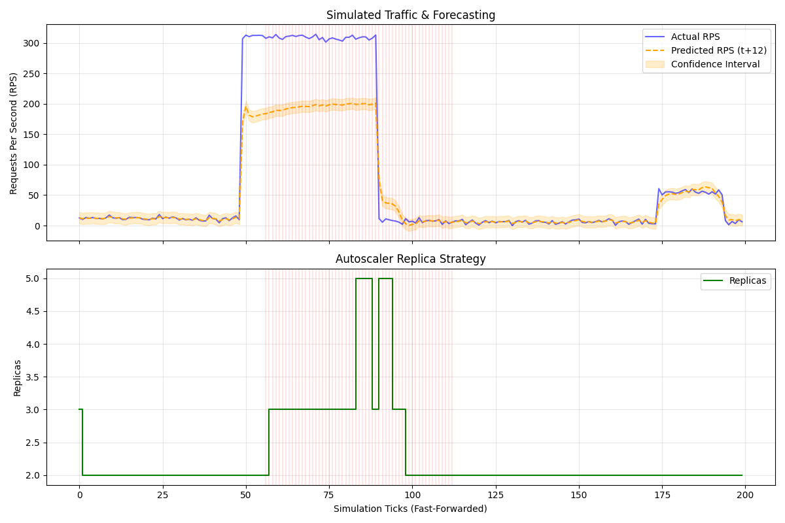

# Predictive Autoscaler

Autoscale is an experiment in bridging the gap between Machine Learning forecasting and deterministic infrastructure scaling (specifically Kubernetes).

## The Problem
Most horizontal pod autoscalers (like the default Kubernetes HPA) are **reactive**. They wait until a metric (like CPU or Request latency) spikes above a certain threshold, and *then* they spin up new pods. By the time those new pods initialize and start taking traffic, the users have already experienced timeouts and degraded performance.

The theoretical solution is to use an AI model to predict the traffic before it arrives. 

However, the obvious issue is that AI models (especially sequence models predicting chaotic web traffic) hallucinate or make mistakes. If an AI's output is wired directly to a Kubernetes scaling API, a single bad prediction could accidentally scale a cluster to 1,000 nodes and exhaust all underlying hardware bandwidth, or scale it to 0 and take down a production site.

## How Autoscale Solves It
Autoscale operates as a dual-layer system.

1. **The Brain (Prediction):** A PyTorch Gated Recurrent Unit (GRU) model looks at the last 15 minutes of traffic and forecasts the next 6 minutes.
2. **The Safety Net (Deterministic Bounds):** Instead of blindly trusting the model, Autoscale calculates a statistical "Error Bound" based on historical accuracy (e.g., ±9 RPS). The system tracks real traffic against this specific confidence interval. 

If traffic stays within the predicted bounds, Autoscale scales safely and linearly. If traffic violently breaks out of these bounds, a custom **Burst Detector** state machine intercepts the signal. It mathematically decides if this is just random noise, or a true traffic shockwave. If it's a true burst, it triggers emergency scaling rules (bypassing normal cooldowns) to save the cluster. If the neural network panics and spits out `NaN`s, the system instantly disconnects the AI and reverts to safe 1-to-1 linear scaling.

### System Flow
```text
  Traffic History
        ↓
     GRU Model
        ↓
   Error Bounds
        ↓
  Burst Detector
        ↓
  Scaling Policy
        ↓
    Kubernetes
```

## Documentation (How it works under the hood)
Because the logic bridging the probabilistic ML model to the hard-coded Kubernetes limits is complex, the mechanics are broken down into the `docs/` folder:

* `docs/overview.md` - High-level architecture and data-flow map.
* `docs/prediction.md` - Details on the PyTorch GRU model and the fail-safes written to catch AI panics.
* `docs/burst_detection.md` - How the error bounds, sliding windows, and anomaly state machine works.
* `docs/scaling_policy.md` - The exact math behind the hard limits, step-caps, and cooldown bypasses.
* `docs/simulation.md` - How the synthetic time-traveling testing environment works.
* `docs/audit_findings.md` - A report on the specific logical edge-cases and bugs encountered and fixed during development.

## Evaluating the System (Running the Simulator)
Testing time-based scaling logic against an ML model is notoriously hard to do in real-time. To make iterating on this easy, Autoscale includes a fast-forwardable simulation engine.

A synthetic 200-tick simulation (which injects a massive +300 RPS burst) can be run in under a second:
```bash
python sim/runner.py
```
This generates a detailed `sim/report.png` graph so the predictor and scaling policies can be visually audited without needing a real Kubernetes cluster.



To execute it against a live `kubeconfig`:
```bash
python main.py
```

## 🚀 What I'm Working On (v1.5 Roadmap)

The core architecture is solid, but the next evolution of Autoscale is already being drafted. The v1.5 release will focus on making the AI multi-dimensional and introducing dynamic, latency-aware guardrails.

```text
v1.5 Roadmap
├── Multivariate GRU Predictor
├── Dynamic Pod Capacity Estimation
├── Latency Guardrail Controller (using the existing SVR model)
└── Multi-Horizon Prediction
```

Read the full technical breakdown on how these components will be integrated in the [v1.5 Roadmap Document](docs/v1.5_roadmap.md).
