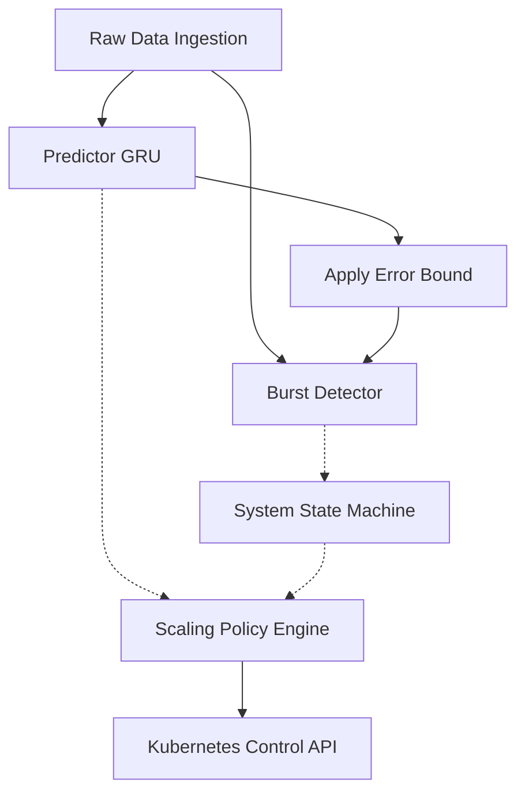

# Overview: Predictive Autoscaler System

The Autoscale system is a sophisticated predictive scaling engine designed to adjust Kubernetes deployment replicas based on projected Request-Per-Second (RPS) loads. Instead of reacting to latency metrics after they spike, this system attempts to predict traffic using a Gated Recurrent Unit (GRU) neural network, bound by localized error calibrations, and filters out noise through a bespoke anomaly-detection state machine.

## Core Capabilities

1.  **Anticipatory Scaling**: A PyTorch-based GRU forecasting model processes historical RPS windows to predict future traffic.
2.  **Safety Error Bounds**: Historical validation residuals dynamically tune ± interval bounds (`uncertainty/calibration.json`) ensuring normal traffic volatility doesn't trigger random scalings.
3.  **Burst Detection**: Interval violations (real RPS falling outside predicted bounds) trigger a sliding-window detector. This identifies and classifies true bursts vs. fast-decaying random spikes, categorizing system state appropriately.
4.  **Deterministic Scaling Rules**: A rigid scaling policy bounds all AI decisions, enforcing step-limits and robust cooldown timers before engaging the Kubernetes API `control/k8_scaler.py`.
5.  **Simulation Environment**: An integrated fast-forwardable simulator allows the entire decision pipeline to be tested synthetically against generated anomaly waves (sine tracking, burst injection) without hitting real Kubernetes infrastructure.

## Data Flow Architecture

## Directory Structure
- `main.py` - Core control loop and entry point.
- `autoscaler/` - Scaling state management, deterministic bounds, step limits, and cooldown calculations.
- `burst_detection/` - Sliding window counters, pattern classification rules, and anomaly detector.
- `config/` - Hardcoded definitions, file paths, model weights paths, and capacities.
- `control/` - K8s interactions (Fetch deployments, Patch replicas).
- `data/` - Raw datasets, Scalers, and preprocessed sequences.
- `predictor/` - Neural Network logic, PyTorch inference wrapper.
- `sim/` - Artificial time progression, Mock clusters, and Report generators.
- `uncertainty/` - Static logic to compute residual boundaries.

## 🚀 Looking Ahead: Autoscale v1.5

The next major release aims to move beyond unidimensional forecasting by integrating deep hardware metrics and latency protections. Check out the formal strategies in the [v1.5 Roadmap](v1.5_roadmap.md).
- **Multivariate GRU predictor:** Expanding inputs to include trailing CPU/Memory usage.
- **Dynamic pod capacity estimation:** Eliminating hard-coded RPS caps via real-time observation limits.
- **Latency Guardrail Controller:** Wiring the pre-trained `performance` SVR model into the policy matrix to mathematically veto scale-actions that would violate latency SLAs.
- **Multi-horizon prediction:** Creating separate scaling layers for Pod creation (+1min) vs EC2 Node Provisioning (+60min).
